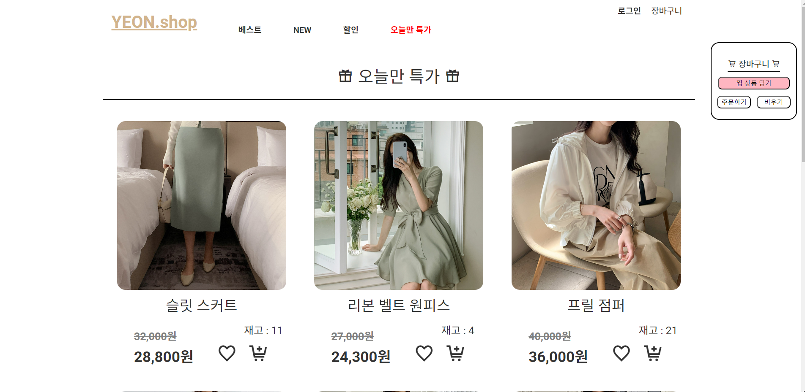
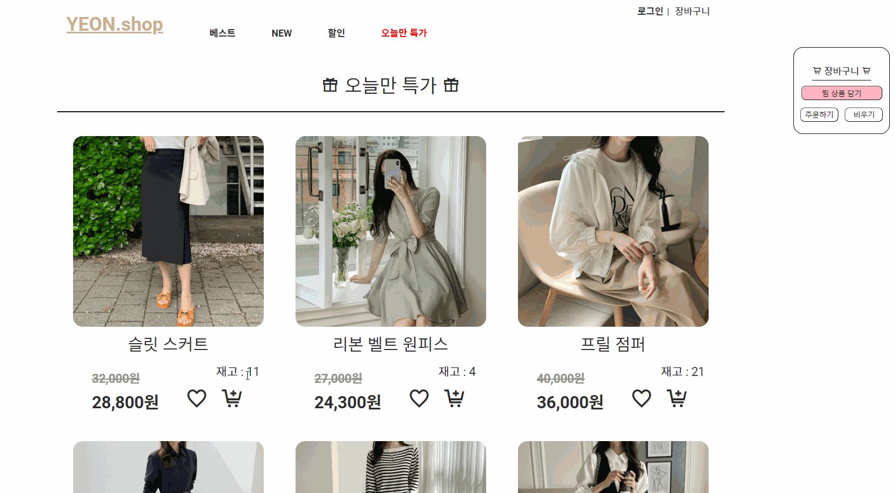
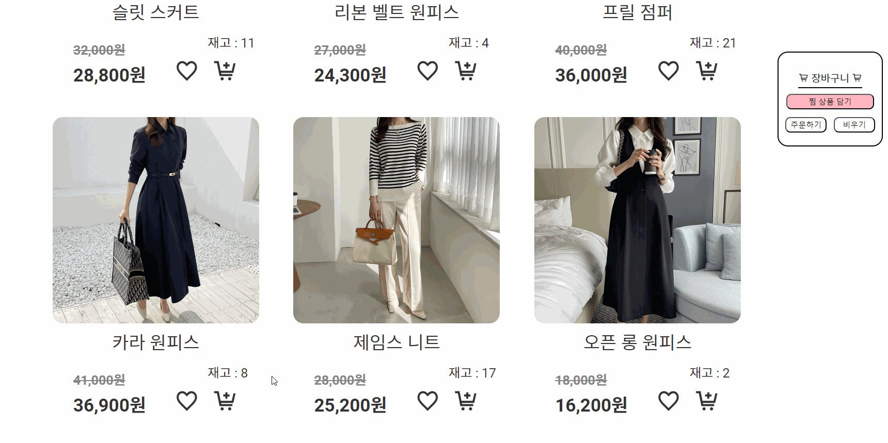
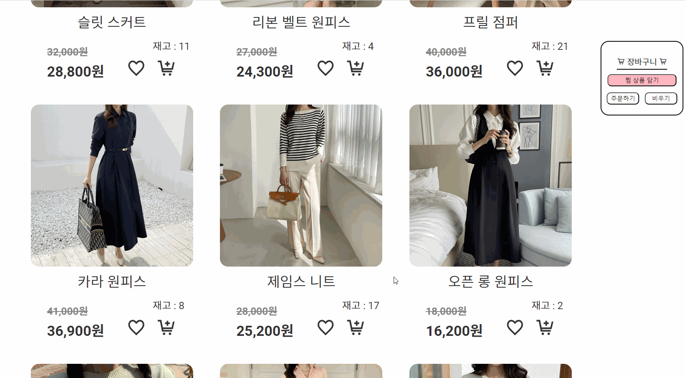
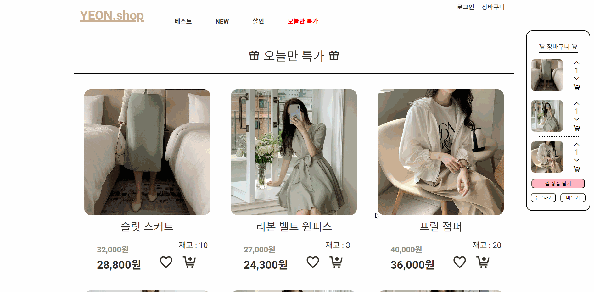
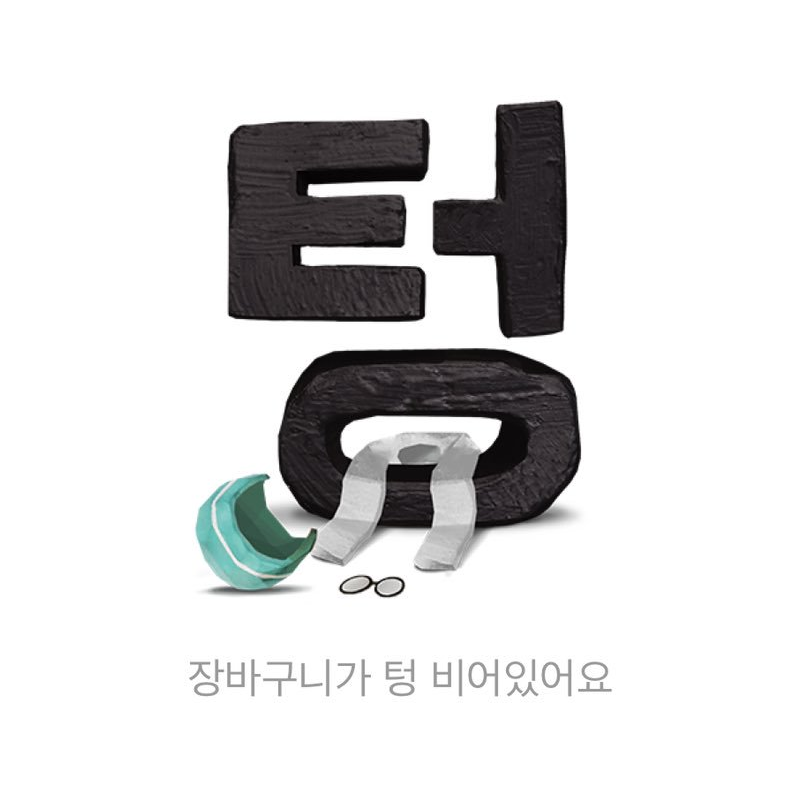

# Personal-project-shopping_basket

(본 개인 프로젝트에 사용된 상품 이미지의 출처는 아뜨랑스 https://www.attrangs.co.kr 입니다.)

## 쇼핑몰 및 장바구니 제작 (개인 프로젝트)

| FE / design | 이상연 | [@yeonhub](https://github.com/yeonhub) |
| ----------- | ------ | ----------------------------------- |

## 프로젝트 참고 사이트

[아뜨랑스](https://www.attrangs.co.kr)

## 프로젝트 기술 스택


## 프로젝트 캡쳐




## 기능 구현

### 1) 객체 데이터 사용

```javascript
let list = [
    { id: 0, name: '슬릿 스커트', price: 32000, stock: 11, heart: false, cart: false, cartStock: 0 },
    { id: 1, name: '리본 벨트 원피스', price: 27000, stock: 4, heart: false, cart: false, cartStock: 0 },
    { id: 2, name: '프릴 점퍼', price: 40000, stock: 21, heart: false, cart: false, cartStock: 0 },
	.
	.
	.
    { id: 11, name: '폴리 치마', price: 18000, stock: 9, heart: false, cart: false, cartStock: 0 }
];
```

찜, 장바구니 상태변수 사용, 수량, 장바구니 수량 두 가지 사용

<br>
<br>

### 2) 장바구니 추가/삭제


장바구니에 담기 버튼을 누르면 해당 버튼의 부모요소를 참조해 장바구니에 추가된다.

마찬가지로 장바구니에 담긴 상품의 제거 버튼을 누르면 해당 상품이 장바구니에서 제거되며, 수량이 제거 된 장바구니의 수량만큼 증가하게 된다.

```javascript
function add() {
    $add.forEach(ele => {
        ele.addEventListener('click', e => {
            let id = e.currentTarget.parentElement.dataset.id;


// cartList를 만들어 해당 상품의 id를 담고 만약 장바구니에 있는 상품일 경우 return을 해 주고 
// 장바구니에 없는 상품일 경우 해당 상품의 cart 값을 true로 변경, 재고량도 변경해 준다.
// 장바구니 아이템은 li를 새로 create 해주고 append 하는 방식으로 구현했다.
// (장바구니 상품 중복 방지)

 
            if (cartList.includes(id)) {
                return
            } else if (list[id].stock !== 0) {
                list[id].cart = true;
                list[id].stock--;
                list[id].cartStock++;
                let li = document.createElement('li');
                let incBtn = document.createElement('button');
                let redBtn = document.createElement('button');
                let span = document.createElement('span');
                let remBtn = document.createElement('button');
                li.dataset.id = list[id].id
                li.innerHTML = `
                
                `
                incBtn.classList.add('incre')
                redBtn.classList.add('redu')
                span.innerHTML = list[id].cartStock
                remBtn.classList.add('remove')

                incBtn.innerHTML = `<i class="xi-angle-up"></i>`
                redBtn.innerHTML = `<i class="xi-angle-down"></i>`
                remBtn.innerHTML = `<i class="xi-cart-remove"></i>`

// creat된 li와 element들을 장바구니 ul에 append 해준다.

                $cartUl.append(li)
                li.append(incBtn)
                li.append(redBtn)
                li.append(span)
                li.append(remBtn)

// 버튼은 create되고 li에 append 한 뒤 아래 함수를 통해 각각에 맞는 기능을 하도록 했다.

                cartPM(incBtn, redBtn)
                cartRemove(remBtn)
                cartList.push(id)
                show();
            }
        })
    })
}
```

```javascript
$rem.addEventListener('click', e => {
    let $cartLis = getAll('#container .cart_box ul li')
    if ($cartLis.length) {
        $cartLis.forEach(ele => {
            ele.remove();
        })
        list.forEach(ele => {

// 제거 된 상품의 찜과 장바구니 변수는 false로 바뀌게 되며,
// 재고가 장바구니의 재고와 합쳐지게 된다.
// 장바구니 재고는 0으로 변경

            ele.heart = false;
            ele.cart = false;
            ele.stock += ele.cartStock;
            ele.cartStock = 0;
        });
        cartList = []
        show()
    }
})
```

<br>
<br>

### 3) 찜 기능


상품의 하트 버튼을 누르면 찜 기능이 활성화 되며 toggle 방식으로 하트가 바뀐다.

우측 장바구니엔 찜 한상품들을 담을 수 있는 버튼이 있고 이미 장바구니에 있는 상품들은 제외된다.

```javascript
$jjimCart.addEventListener('click', e => {
    for (let i = 0; i < idList.length; i++) {
        list[idList[i]].heart = true;
    }

// deduList는 찜한 상품이 장바구니에 추가 될 때 이미 장바구니에 있는 상품(cartList)와 비교하여
// 중복 되지 않는 상품들만 담을 수 있도록 하기 위해 추가했다.

    deduList = idList.filter(item => !cartList.includes(item));

// 찜한 상품과 장바구니에 있는 상품의 중복을 제거 후 장바구니에 추가되어야 할 상품이 있으면 if true문 실행

    if (deduList.length != 0) {
        for (let i = 0; i < deduList.length; i++) {

// 중복 제거 된 상품들은 장바구니에 담겼다는 상태변수 cart=true가 되고,
// 재고가 하나 줄게 됨과 동시에 장바구니 재고는 하나가 추가된다.
// 그 이후는 장바구니에 추가 되는 과정이랑 동일하다.

            list[deduList[i]].cart = true;
            list[deduList[i]].stock--;
            list[deduList[i]].cartStock++;
            let li = document.createElement('li');
            let incBtn = document.createElement('button');
            let redBtn = document.createElement('button');
            let span = document.createElement('span');
            let remBtn = document.createElement('button');
            li.dataset.id = list[deduList[i]].id
            li.innerHTML = `
            
            `
            incBtn.classList.add('incre')
            redBtn.classList.add('redu')
            span.innerHTML = list[deduList[i]].cartStock
            remBtn.classList.add('remove')

            incBtn.innerHTML = `<i class="xi-angle-up"></i>`
            redBtn.innerHTML = `<i class="xi-angle-down"></i>`
            remBtn.innerHTML = `<i class="xi-cart-remove"></i>`

            $cartUl.append(li)
            li.append(incBtn)
            li.append(redBtn)
            li.append(span)
            li.append(remBtn)

            cartPM(incBtn, redBtn)
            cartRemove(remBtn)

            list[deduList[i]].heart = false;
        }
        idList = []
        cartList = []
        deduList = []

// 중복 제거한 deduList가 빈 배열이라면 아래 else문이 실행된다.

    } else {
        idList = []
        cartList = []
        deduList = []
    }
    // heart remove
    let heartElement = document.querySelector('.xi-heart');
    if (heartElement) {
        heartElement.classList.remove('xi-heart');
        heartElement.classList.add('xi-heart-o');
    }
    // heart state false
    idList = []

    let cartLi = getAll('#container .cart_box ul li')
    cartLi.forEach(ele => {
        cartList.push(ele.dataset.id)
    });
    cartList = cartList.filter((value, index, self) => self.indexOf(value) === index);

// 마지막엔 재고, 장바구니 재고, 장바구니 상품들을 다시 화면에 출력해 주는 show함수가 실행된다.

    show();

})
```

<br>
<br>

### 4) 수량 증감 기능


현재 남아있는 수량 기준으로 주문 가능한 최대 수량을 넘을 수 없고, 1미만의 수량도 지정할 수 없다.

```javascript
function cartPM(incBtn, redBtn) {
    incBtn.addEventListener('click', e => {
        let id = e.currentTarget.parentElement.dataset.id

// if 조건문에서 상품의 재고가 0이 아닌경우 장바구니의 증가 버튼을 눌렀을 때
// 재고는 줄어들고 장바구니의 재고는 증가하게 된다.

        if (list[id].stock !== 0) {
            list[id].stock--
            list[id].cartStock++
            e.currentTarget.nextElementSibling.nextElementSibling.textContent = list[id].cartStock;
            show();
        }
    })
    redBtn.addEventListener('click', e => {

        let id = e.currentTarget.parentElement.dataset.id

// 감소도 마찬가지로 최소 1개의 수량이 남을 때 까지 재고와 장바구니 재고가 증감하게 된다.

        if (list[id].cartStock !== 1) {
            list[id].stock++
            list[id].cartStock--
            e.currentTarget.nextElementSibling.textContent = list[id].cartStock;
            show()

        }
    })
}
```

<br>
<br>

### 5) 장바구니 페이지


장바구니 페이지에선 장바구니에 담긴 상품과 가격, 수량, 총 금액을 확인할 수 있다.

또한 수량의 증감이 가능하고 특정 상품만 구매가 가능하며 장바구니에 아무 상품이 없을 시 '텅' 화면이 나오게 된다.

```javascript
function showCart() {
    $cartpageUl.innerHTML = ''

// 장바구니에 담긴 상품의 정보가 담긴 cartList가 비어있게(cartList.length === 0) 되면 텅 이미지 출력

    if (cartList.length === 0) $cartpageUl.innerHTML = '<li class="t"></li>'

// 장바구니 화면 전환시 cartList를 토대로 새로운 li를 create 하게 된다.
// 수량의 증감 버튼도 추가를 해주고, 삭제 버튼도 추가를 해준다.

    cartList.forEach((ele, idx) => {
        let liC = document.createElement('li');
        let chkBtnC = document.createElement('i');
        let stock = document.createElement('div');
        let price = document.createElement('div');
        let incBtnC = document.createElement('button');
        let redBtnC = document.createElement('button');
        let spanC = document.createElement('span');
        let remBtnC = document.createElement('i');
        let idC = cartList[idx]


        chkBtnC.classList.add('xi-check-circle-o')
        liC.append(chkBtnC)
        liC.innerHTML = `
        
        <p>${list[idC].name}</p>
        `
        incBtnC.classList.add('increB')
        redBtnC.classList.add('reduB')
        spanC.innerHTML = list[idC].cartStock
        remBtnC.classList.add('xi-close')

        incBtnC.innerHTML = `<i class="xi-angle-up"></i>`
        redBtnC.innerHTML = `<i class="xi-angle-down"></i>`
        stock.classList.add('stock')
        stock.append(incBtnC)
        stock.append(spanC)
        stock.append(redBtnC)
        liC.append(stock);

        price.classList.add('price')
        price.innerHTML = `
        <strong class="ori_pB">${priceToString(list[idC].price)}원</strong>
        <strong class="sal_pB">${priceToString(list[idC].price * 0.9)}원</strong>
        `
        liC.append(price)
        liC.append(remBtnC)
        liC.dataset.id = list[idC].id
        liC.insertBefore(chkBtnC, liC.firstChild);
        $cartpageUl.append(liC)

        cartPMC(incBtnC, redBtnC)
        cartRemoveC(remBtnC)
        chkC(chkBtnC)


    })
    totalPrice()
}
```

```java
function totalPrice() {
    let cartItems = list.filter(item => item.cart === true);
    let prices = cartItems.map(item => item.price);
    let cartStocks = cartItems.map(item => item.cartStock);
    let total = 0;

// 장바구니에 담긴 상품들의 가격과 수량을 곱해 총 가격을 구한다.

    for (let i = 0; i < prices.length; i++) {
        total += (prices[i] * 0.9) * cartStocks[i]
    }
    if (prices.length === 0) total = 0;

    $price.innerHTML = `상품 금액 ${priceToString(total)}원 + 배송비 3,000원 = ${priceToString(total + 3000)}원`
}
```
